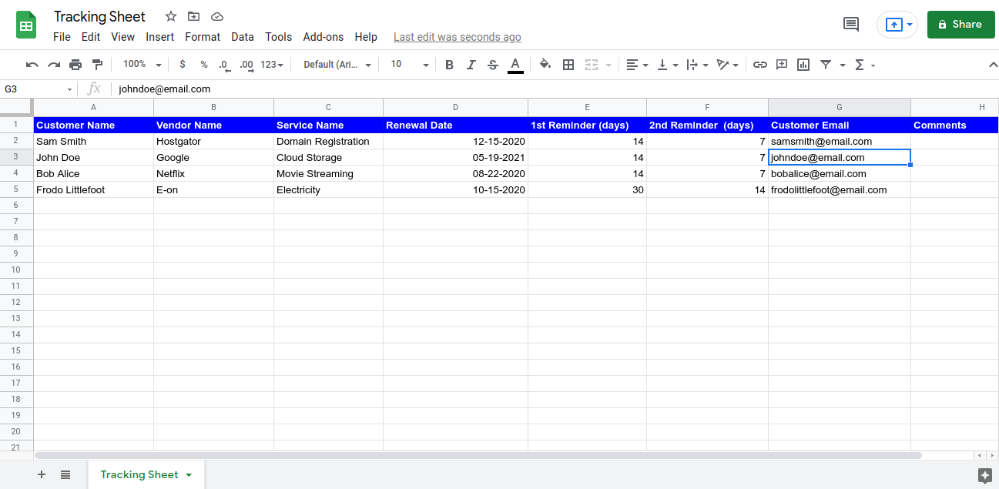

# **Subscription reminder script for Google Sheet**

## **Introduction**
Just a bit of script to create a subscription reminder using Google sheet, so you'll never miss a bill again.

## **Personal use case** 
Here is the example for using the script coupled with your own e-mail address; this is what the table should look like (comprised of 6 columns).


If you need to add any extra columns, you can start adding them after "2nd Reminder (days) i.e. column F", and then modify the following codes: 

``` const data = trackingsheet.getRange(2, 1, trackingsheet.getLastRow() - 1, numberOfColumns).getValues(); ```

Substitute ```numberOfColumns``` with number of your choice depending on how many columns you may need.

May you need to retreive the data from more columns of each row, you can add the following code after the line *#16*:
``` const thatSpecificColumnName = row[n] ``` where ```n``` is the column number corresponding to ```thatSpecificColumnName``` minus ```1```, because in Computer Science world counting starts from ```0```. For example, the index for the first column of the row is ```0``` i.e. ```row[0]``` not ```row[1]```. 

## **For small business use *(customer number < 1000)***
Here is the example for using the script coupled with your customers' e-mail addresses; this is what the table should look like (comprised of 7 columns).



If you ever need to add any new columns to the table, please follow the instruction above, and add the columns on the Google sheet after the column that's assigned to **Customer Email i.e. column G**.

You can also add any data retrieval script after ```const recipientEmail = row [6]``` which is located on the line *#22*.

## **Adding extra functionality to the sheet**

If you want to add to the script to perform more tasks that it's currently doing, please visit the following page: 

[Goolge Apps Script - Class Sheet](https://developers.google.com/apps-script/reference/spreadsheet/sheet)
